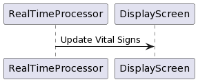
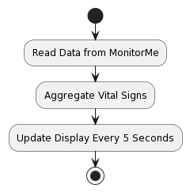
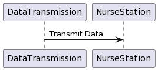
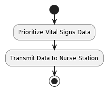
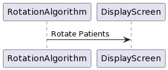
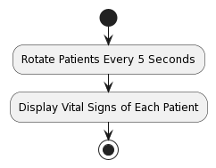

# Nurse station

## Section Overview
Design considerations for the nurse station in the MonitorMe system. It outlines various challenges and proposes solutions to ensure efficient and effective monitoring of patients' vital signs.

# Problems and Solutions

## 1. Real-time Data Display

### 1.1 Design Solution:
Utilize a real-time data processing engine to aggregate and display patients' vital signs on the nurse station screen. The system should update the display every 5 seconds with the latest data for each patient.

###  1.2 Use Case:

### 1.3 Work-flow Diagram:

## 2. Data Transmission 

### 2.1 Design Solution:
Data transmission protocol optimized for low latency and high throughput to ensure timely updates on the nurse station screen. Prioritize vital signs data transmission based on its criticality and update frequency.

###  2.2 Use Case:

### 2.3 Work-flow Diagram:

## 3. Patient Rotation Management

### 3.1 Design Solution:
Patient rotation algorithm that cycles through the list of patients every 5 seconds, displaying the vital signs of each patient on the nurse station screen. Ensure that the rotation algorithm accounts for the maximum number of patients per nurse station upto 20.

###  3.2 Use Case:

### 3.3 Work-flow Diagram:
