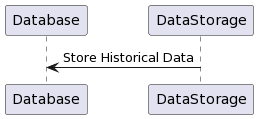
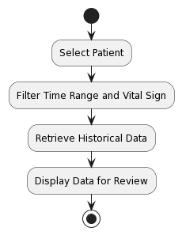
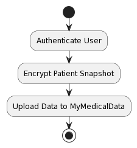

# Patient

## Section Overview
Design considerations for managing patient vital sign data and providing access to medical professionals for reviewing historical data. Addresses functionality for securely uploading patient snapshots to MyMedicalData through a secure HTTP API call.

# Problems and Solutions

## 1. Historical Data Storage

### 1.1 Design Solution:
Store the past 24 hours of all vital sign readings for each patient in a database. Utilize a relational or time-series database for efficient storage and retrieval of historical data.

###  1.2 Use Case:

## 2. Historical Data Review

### 2.1 Design Solution:
User interface for medical professionals to review patient historical data. Provide filtering options for selecting a specific time range and vital sign for analysis.

### 2.2 Work-flow Diagram:

## 3. Secure Data Upload to MyMedicalData
### 3.1 Design Solution:
Secure HTTP API endpoint for uploading patient snapshots to MyMedicalData. Use authentication and encryption mechanisms to ensure data security during transmission.

### 3.2 Work-flow Diagram:
