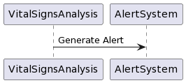
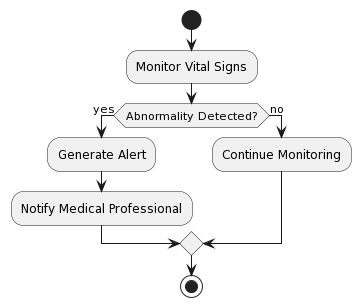
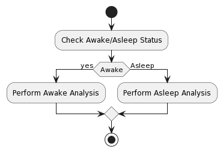
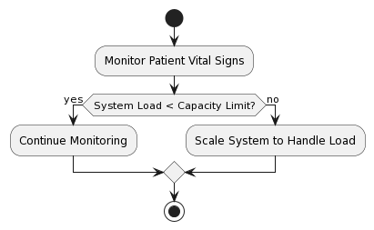

# MonitorMe

## Section Overview
Design considerations for the MonitorMe system, focusing on analyzing patient vital signs, detecting issues, and alerting medical professionals. Addresses the system's capacity to support a maximum of 500 patients per physical instance.

# Problems and Solutions
##  1. Vitals Analysis and Alerting Genration
### 1.1 Design Solution:
Real-time monitoring and analysis module that continuously evaluates each patient's vital signs. Set up predefined thresholds for vital signs and monitor trends to detect abnormalities. Send alerts and notify medical professionals when abnormalities are detected.

###  1.2 Use Case:

### 1.3 Work-flow Diagram:

# 2. Awake/Asleep Dependency for Analysis
## 2.1 Design Solution:
Integrate awake/asleep status into the analysis module to adjust trend and threshold analysis. Implement different sets of thresholds and analysis algorithms based on whether the patient is awake or asleep.

### 2.2 Work-flow Diagram:

# 3. System Capacity
## 3.1 Design Solution:
Scalability features to support upto 500 patients per physical MonitorMe instance. Use distributed architecture and load balancing techniques to distribute the workload evenly across multiple instances if needed.

### 3.2 Work-flow Diagram:
