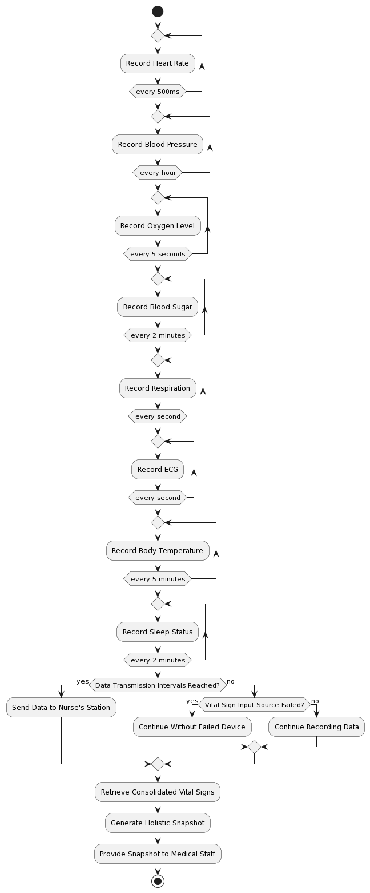

# Vital signs

## Section Overview
Vital sign recording and display system in the MonitorMe setup. It outlines the challenges related to recording patient data from various vital sign input sources and ensuring continuous data transmission to the nurse's station. Additionally, it covers the generation of holistic snapshots from a patient's consolidated vital signs.

# Problems and Solutions
## 1. Continuous Data Transmission
### 1.1 Design Solution:
Implement a data transmission protocol that ensures continuous data transmission from vital sign input sources to the nurse's station. Develop a fault-tolerant mechanism where even if one vital sign input source device fails, the functional devices continue sending data without interruption.

### 1.2 Work-flow Diagram:

