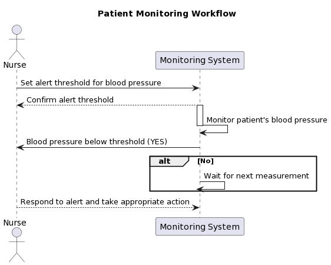
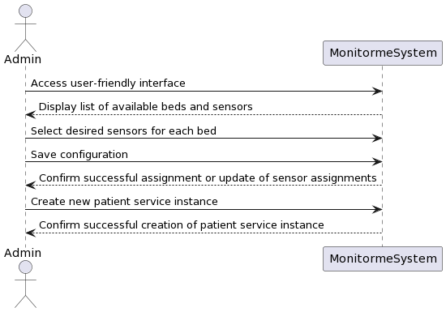

# UI/UX Solutions

# Overview
The UI/UX module of MonitorMe to address several common problems faced by healthcare professionals when monitoring patients. These include alert fatigue, user error, lack of customization, slow response time, and inadequate security. By addressing these issues, we aim to improve patient care and reduce the risk of medical errors.

## Alert Fatigue Solution
To address alert fatigue, MonitorMe provides a customizable alert system that allows healthcare professionals to set their own alert thresholds for each vital sign parameter. This ensures that they only receive critical alerts that require immediate attention, reducing desensitization and missed critical alerts.

### User story
A healthcare professional is monitering a patient who has history of low blood pressure. The professional sets an alert threshold for blood pressure so that it gets realtime monitored, whenever if the patient's blood pressure drops bellow a certain level. The professional receives an alert immediately and respond quickly to prevent situation goes worse.

## User Error Solution
To minimize user error, MonitorMe provides clear instructions and intuitive controls for all functions. The interface is designed to be easy to use and understand, reducing the risk of misinterpreting or entering incorrect values.

### User story
The admin might need to assign various hardware sensors together with beds to create a 'patient service' instance, enroll with healthcare professionals, and patient.
The user-friendly interface displays a list of available beds and sensors, so that, admin can then select the desired sensors for each bed and save the configuration. The operation of update, remove senssor assignments is easy to make. The system is also designed to allow the admin enroll patients, healthcare professionals in an easy way.

