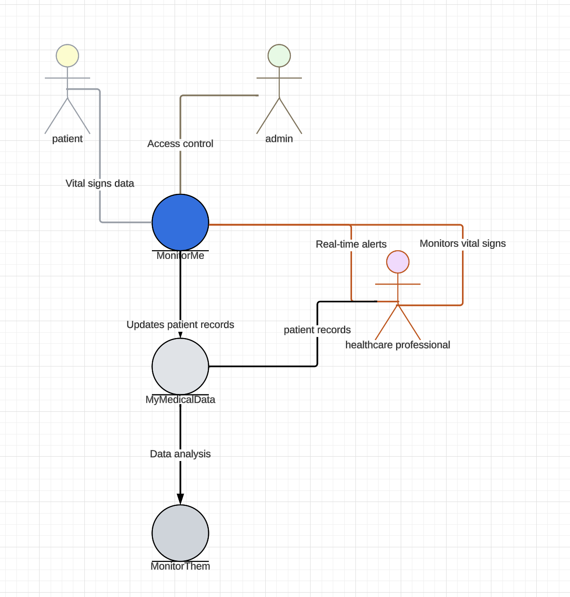

# Vision

MonitorMe is a patient monitoring system designed to streamline the process of tracking and analyzing vital signs.

It consolidates data from multiple sources, providing a unified view of a patient's health status.

The system also alerts medical professionals of potential issues based on real-time data analysis. This innovative solution aims to enhance patient care and improve the efficiency of healthcare providers.

## background
StayHealthy, Inc. is a large and highly successful medical software company located in San Francisco, California, US. They currently have 2 popular cloud-based SAAS products: MonitorThem and MyMedicalData.

MonitorThem a data analytics platform that is used for hospital trend and performance
analytics—alert response times, patient health problem analytics, patient recovery analysis, and so on.

MyMedicalData is a cloud-based patient medical records system used by doctors, nurses, and other heath professionals to record and track a patients heath records with guaranteed partitioning between patient records.

## overview

# Reqirements analysis
The requirements analysis we have done including functional and non-functional requirements.
Also, after 2 sessions brainstorming, we believe in security and performance is critial to the success.

## Functional requirements
1. Data collection from sensor devices
   MonitorMe should read data from eight different patient-monitoring equipment vital sign input sources: heart rate, oxygen level blood sugar, respiration rate, electrocardiogram (ECG), body temperature, and sleep status (sleep or awake).
2. Data transmition
  All patient sensoring devices communicates within the system regarding vital sign readings at different rates. The system must be able to support the varying data transmission rate in an effective way.
  As data sampling is streaming constantly from many sensor devices, meanwhile, there could be commands interactions to devices for configrations or change settings, the data needs to be queued to keep traffic smooth.
3. Data consolidation
  Just like we create an order for shopping, an entity of 'order' could include various 'shopping items' which are allocated from different product storage. En patient snapshot should include related information such as:
  patient id and patient information
  sensor id and sensor data in a certain time duration
  healscare professionals
4. Data storage
  For each vital sign, it is required that MornitorMe must record and store the past 24 hours of all vital sign readings. A medical professional can review this history, filtering on time range as well as vital sign.
  We believe security is important here, so we consider to make each patients records could be stored in separate database physically separation of data helps to ensure data records are not mixed up. Also, we want further introduce admin functions for access control, data encryption and audit logs to keep detailed logs of all access and changes to patient records.
  A good idea might be we hold most of the data in local MonitorMe, for most 'micro-services', they should be installed and run at local.
  For analysis or research purposes, create anoymized data sets, so to make sure it can't be linked back to individuals.
5. Role and Security Management
  The system should have admin functions for managing roles of patients and healthcare professionals, and for setting data access policies for security profiles.
  For example, when a new patient come to the nurse station, the admin shall be able to enroll the person with devices, healthcare professionals to the system.
6. Micro service platform and services
  Various microservices could be applicable in the MonitorMe system, such as Data ingestion service, data storage service, data analysis service, user management service, nurse station service, alert notification service, patient report service, api gateway service, security service, and etc.

## Non-functional requirements
1. Availability
  The system should be designed to ensure high availability, meaning it should be accessible and usable by medical professionals at all times. This can be achieved through redundant systems, failover mechanisms, and regular maintenance and monitoring.
2. Reliability
  The system must be highly reliable, with minimal downtime or errors. This can be achieved through rigorous testing, quality assurance processes, and regular updates and maintenance.
  For example,
  while one sensor stops working, it should not impact other data collection.
  We should do multi samples for single report, so to make sure each individual measure error does not impact the accuracy, e.g. the Oxygen level is required to report every 5 seconds, but inside of each sensor device, we will implement the measurement of >10 times per seconds, this could even to be configurable by the healthcare professionals.
3. Performance and elasticity
  The system should be designed to handle a large volume of data traffic from users while maintaining fast response times and low latency. This can be achieved through:
   efficient message/data queue,
   architecture design,
   optimized database design,
   and appropriate hardware specifications.
4. Scalability
  The system should be able to scale up or down based on demand, allowing it to accommodate an increasing number of patients and data sources over time.
  This can be achived by structuring between 'nurse station' and 'MonitorMe', to make the flexibility for 'hospitals' or care centers to deploy with light weight or heavy weight.
5. Security
   Given the sensitive nature of the data, the system must ensure high levels of security to protect patient data from unauthorized access or breaches.

## Performance Characteristics

Each patient monitoring device transmits vital sign readings at a different rate:
Heart rate: every 500ms
Blood pressure: every hour
Oxygen level: every 5 seconds
Blood sugar: every 2 minutes Respiration: every second
ECG: every second
Body temperature: every 5 minutes Sleep status: every 2 minutes
Maximum number of patients per physical MonitorMe instance: 500
MonitorMe reads data from eight different patient-monitoring equipment vital sign input sources: heart rate, blood pressure, oxygen level, blood sugar, respiration rate, electrocardiogram (ECG), body temperature, and sleep status (sleep or awake). It then sends the data to a consolidated monitoring screen (per nurses station) with an average response time of 1 second or less. The consolidated monitoring screen displays each patients vital signs, rotating between patients every 5 seconds. There is a maximum of 20 patients per nurses station.

# Business constrains
1. Security and privacy, prioritize data privacy including regulatory compliance, the system must comply with relevant healthcare regulations and standards, such as HIPAA or GDPR, to ensure the privacy and security of patient data.
2. Budget constraints
3. Time to market
4. Maintenance and support, the system must be easy to maintain by both StayHealthy and clients

# Techinical constrains
Some technical constrains could be applicable in the MonitorMe system:
1. Maxium patients per nurse station
2. Maximum patients per MonitorMe instance
3. Data Storage Capacity, for each patients vital sign, Monitor Me must record and store the past 24 hours of all vital sign readings.
4. Security Protocols

# Customer Maintenance, workflows todo
Add/Remove device
Sign/Resign nurse, doctors
Add/Remove local servers for local services
MonitorMe should be provided with comprehensive hardware and software by StayHealthy. Inc.
The platform, data stores, databases, and other technical tools and products are unspecified at this time and will be based on your on-prem architectural solution.
